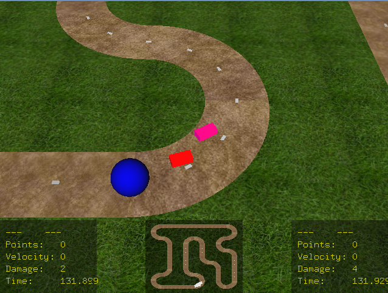

# OpenGLRacing

Simple racing game made with OpenGL.

The code is not very optimized as it was made a long time ago, during my BSc.

## To compile on Linux:

`$ make`

And then run:

`$ ./test`

## To compile on Windows:

Open **/cglib.vsnet/cglib.sln** with Visual Studio.

And then build and run.

.